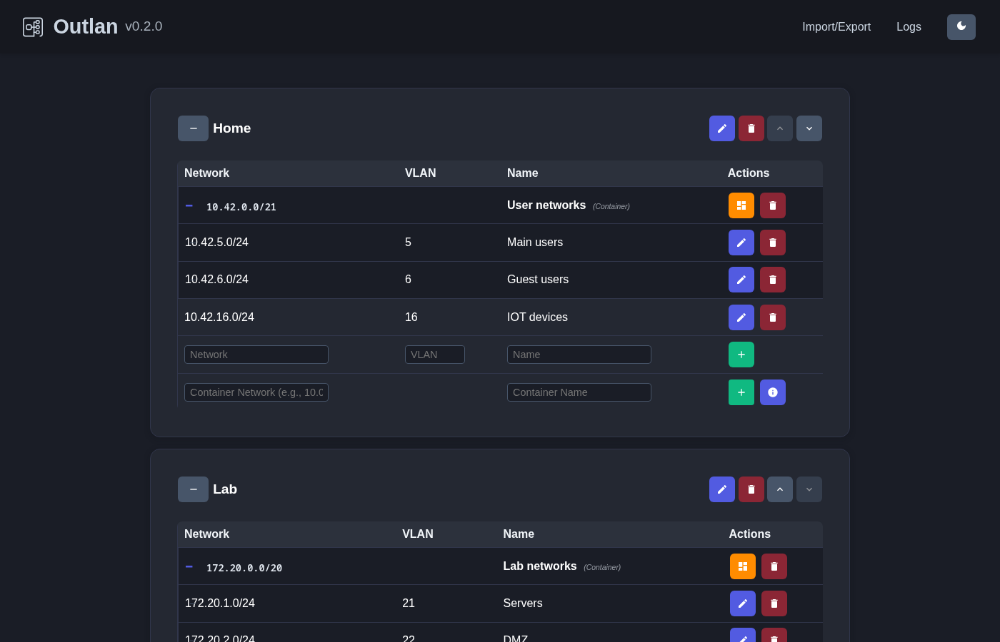
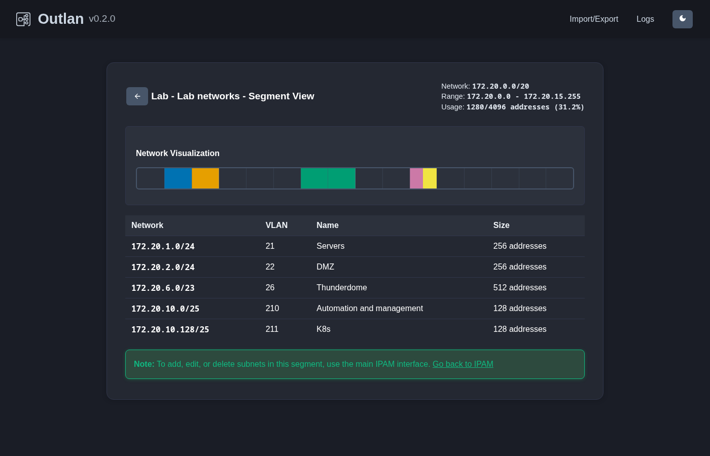
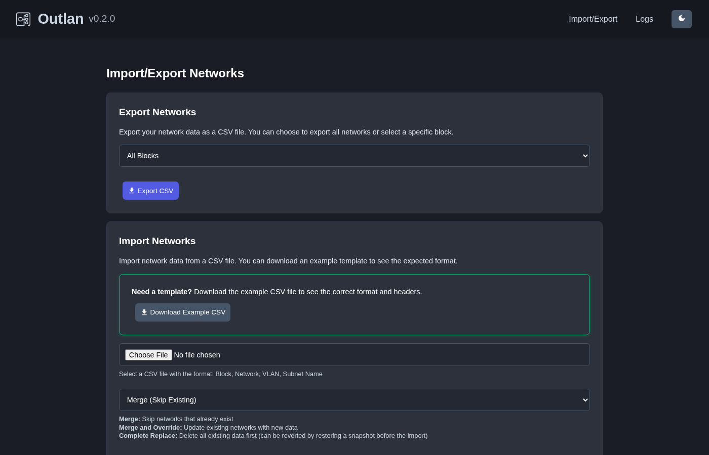
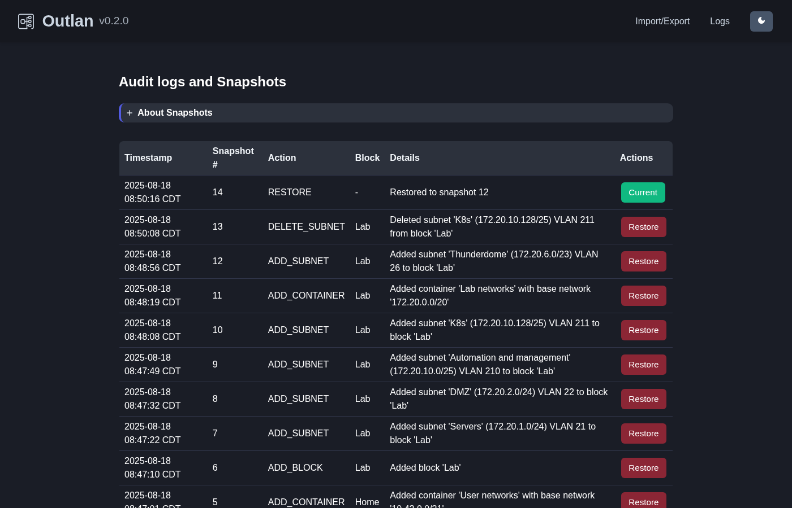

# Outlan IPAM

<p align="center">
  
</p>

A minimal IP Address Management (IPAM) system for small networks and labs (such a homelab). Simple web interface for network documentation with blocks, subnets, VLAN assignments, audit logging, and data import/export.

**Current Version**: 0.2.1

## Features

- **Network Blocks & Subnets**: Organize IP addresses with VLAN assignments (1-4094 range)
- **Network Containers**: Group related subnets for better organization
- **Data Management**: CSV import/export, snapshots, and audit logging  
- **REST API**: Full programmatic access with Swagger documentation
- **Modern Interface**: Responsive design with multiple themes
- **Docker Ready**: Easy deployment with Docker and Docker Compose
- **Privacy First**: Complete data sovereignty with local-only operation—no telemetry or external data transmission.

## Screenshots

### Main Interface


### Network Segment View


### Import/Export


### Audit Logging


## Quick Start

### Docker (Recommended)

```bash
# Using GitHub Container Registry
docker run -d \
  --name outlan \
  -p 5000:5000 \
  -v $(pwd)/data:/app/data \
  -e TZ=America/Chicago \
  ghcr.io/adrydale/outlan:latest
```

### Docker Compose

```yaml
services:
  outlan:
    image: ghcr.io/adrydale/outlan:latest
    ports:
      - "5000:5000"
    volumes:
      - ./data:/app/data
      - ./logs:/app/logs
      - ./config:/app/config
    environment:
      - TZ=America/Chicago
```

Access at `http://localhost:5000` and follow setup prompts.

## Configuration

All configuration options can be set via environment variables or `/app/config/settings.ini` file:

| Variable | Default | Description |
|----------|---------|-------------|
| `DB_PATH` | `/app/data/ipam.db` | Database file location |
| `DB_TIMEOUT` | `10` | Database connection timeout (seconds) |
| `DEFAULT_SORT` | `VLAN` | Default sort field (Network/VLAN/Name) |
| `THEME` | `dark` | UI theme (light/dark/midnight) |
| `SNAPSHOT_LIMIT` | `200` | Maximum snapshots to keep |
| `SECRET_KEY` | `your-secret-key-change-in-production` | Flask secret key for sessions and flash messages |
| `LOG_LEVEL` | `INFO` | Logging level (DEBUG/INFO/WARNING/ERROR) |
| `LOG_MAX_SIZE_MB` | `5` | Maximum log file size in MB |
| `LOG_BACKUP_COUNT` | `5` | Number of rotated log files to keep |
| `TZ` | `Etc/GMT` | Timezone for timestamps and logging |

**Configuration precedence:** Environment variables (highest priority) → `/app/config/settings.ini` → application defaults (lowest priority).

## API Documentation

Full REST API with comprehensive CRUD operations and filtering capabilities. Interactive documentation available at `/api/swagger/` when running.

### Core Endpoints
- `GET /api/health` - Application health check with database validation
- `GET /api/version` - Application version information
- `GET/POST/PUT/DELETE /api/blocks` - Network blocks management
- `GET/POST/PUT/DELETE /api/containers` - Network containers (segments) management
- `GET/POST/PUT/DELETE /api/networks` - Subnet management within blocks

### Features
- **Full CRUD operations** - Create (POST), read (GET), update (PUT), delete (DELETE) for all resources
- **Advanced filtering** - Search by name, filter by block/VLAN, case-insensitive
- **Validation** - Input validation with detailed error messages
- **Swagger documentation** - Interactive API explorer and testing
- **JSON responses** - Consistent response format with success/error handling
- **Resource relationships** - Proper linking between blocks, containers, and networks

## Development

### Local Development
```bash
# Clone and setup
git clone <repo-url>
cd outlan
pip install -r requirements.txt

# Run locally
flask --app app run --debug

# Run tests  
pytest

# Pre-commit hooks
pre-commit run --all-files
```

### Development Workflow

**Branch Strategy:**
- `main` - Stable releases only
- `develop` - Active development branch

**Contributing:**
1. Create feature branch from `develop`
2. Make changes and test locally
3. Submit PR to `develop` branch
4. After testing, `develop` is merged to `main` for release

**Image Building:**
- Push to `develop` → `ghcr.io/adrydale/outlan:develop`
- Push to `main` → `ghcr.io/adrydale/outlan:latest`
- Git tag `v*` → `ghcr.io/adrydale/outlan:v0.2.1` + GitHub release

## Docker Images

Available tags from `ghcr.io/adrydale/outlan`:
- `latest` - Latest stable release from main branch
- `develop` - Development builds from develop branch  
- `v0.2.1` - Specific version tags

## License

MIT License - see LICENSE file for details.

---

*Outlan was developed with assistance from Claude Code.*
